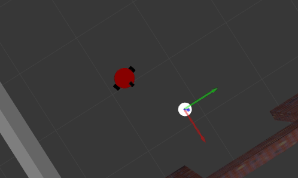
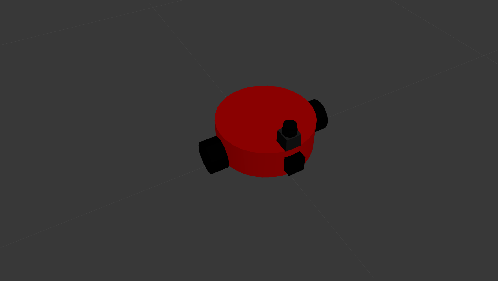

# A ball chaser

This is a simple differential-drive robot haused in single floor building simulated in Gazebo.
The robot is controlled by ROS. The robot is equipped with camera and Hokuyo laser scaner. 

<p align="center">
  
  <br>Robot chasing white ball
</p>


## How to use

In order to run this package follow this steps:
* Make direcotry for catkin workspace:
```sh
mkdir -p path_to_my_workspace/workspace_name/src
```
* Go to the src direcotry and init catkin workspace:
```sh
cd path_to_my_workspace/workspace_name/src
catkin_init_workspace
```
* Go to `workspace_name` directory and pull this repository:
```sh
git init
git remote add origin link_to_this_repo
git checkout master
```
* Make catkin:
```sh
catkin_make
source devel/setup.bash
```
* Run ROS:
```sh
roslaunch my_robot world.launch
```
* Run process_image and drive_bot nodes:
```sh
roslaunch ball_chaser ball_chaser.launch
```

## Nodes
Two nodes are essential for **white** ball chasing:
* `process_image` - which subsribes images form camera and finds a **white** blob on it. This node also calls drive_bot service to steer robot
* `drive_bot` - it is a service to drive robot (it could move froward, backward or turn around its veritcal axis)

## Robot

Robot is described in my_robot.urdf file. It is a two-wheeled round-shaped 
vehicle with two caster balls. It is equipped with a monocular camera and
 Hokuyo laser scaner.

<p align="center">
  
  <br>A robot portrait
</p>

## License
The contents of this repository are covered under the [MIT License](./LICENSE.txt)


## Contributing

1. Fork it (<https://github.com/michLab/project_2_ball_chaser.git>)
2. Create your feature branch (`git checkout -b feature/fooBar`)
3. Commit your changes (`git commit -am 'Add some fooBar'`)
4. Push to the branch (`git push origin feature/fooBar`)
5. Create a new Pull Request
